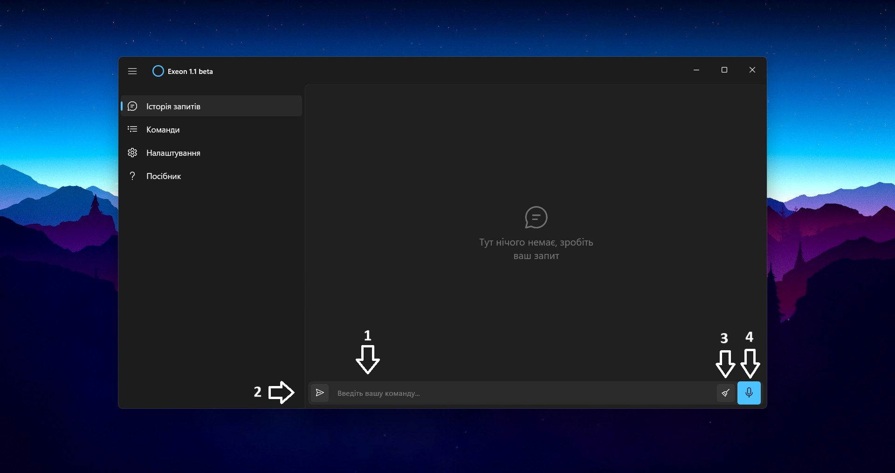
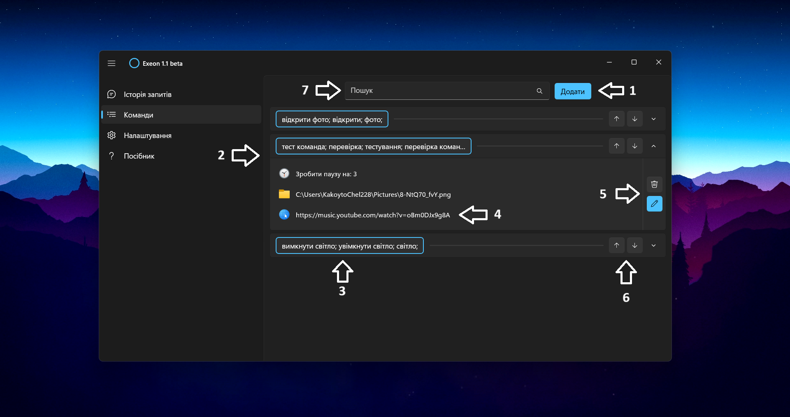
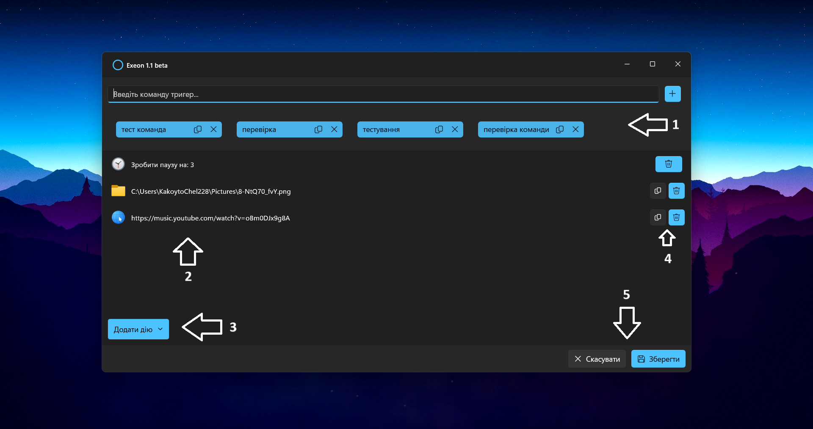
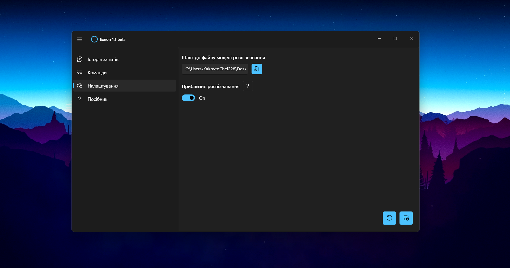

# Project "Exeon 1.1 beta" - Description

## Introduction
**Exeon** - is a desktop application targeting Windows 10 & 11 devices to help users to control and use their PCs with great convenience. But for now it is more of a conceptual project than a commercial one, due to limited functionality at this moment and of course the project is still in a state of development. Next I would like to tell you how to use the current version of this application and what it is capable for.

## Page #1: "Request history"
To get to this section, click on the icon in the upper left corner, open the menu, and select the Request history section. Also, if the sidebar is not hidden, you can open this section by clicking on the corresponding icon with a “message”.

Let's move on to the section itself. In the image below, you can see the page itself and several pointers that focus attention on important interface elements. Under number **(1)** is the field for entering the command that the user wants the application to execute. **(2)** is the button for sending a message/command, which is analogous to the Enter key. Number **(3)** indicates a button that clears the history of requests, the history itself is displayed in the form of a chat, and under number **(4)** we see a button with a microphone, which is responsible for voice input of the command with its subsequent execution.

## Page #2: "Creating custom command"
The main sense of the application is concentrated in this section. A user command is a set of trigger words and a list of actions that are performed when the user calls one of these triggers. **(1)** is a button for creating a new command. After you click it, a field for entering the name of the new trigger and a button on the right to add it will appear. When you have decided on the number of trigger words and their content, click the **'Create'** button, and a new command appears in the list **(2)**.
Under number **(3)**, you can see an example of a list of trigger words - by the way, there is no limit to their number. Number **(4)** demonstrates one of the actions performed by the demo command. The number of such actions is also unlimited. Under numbers **(5)** and **(6)** are buttons for managing commands: delete, edit, move up and down, respectively. And lastly, the search field for commands is located near the pointer **(7)**. The search is performed by trigger words.”

## Page #3: "Editing and filling in commands"

Without going too far from the section on creating commands, let's look at editing and filling them in.
After creating a custom command, it does not necessarily have to contain any data - even trigger words can be added later. By clicking the button with the pencil icon, we go to the editing page.
Block **(1)** contains the interface for interacting with trigger words for the selected command: an input field, an add button, and a list of triggers that can be deleted or copied.
Numbers **(2)** and **(3)** are the list of actions and the button for adding them, respectively. Currently, there are 5 types of actions: opening a file, loading a web page, pausing between actions in seconds, changing the monitor brightness, and changing the overall system volume level.
The buttons next to the pointer **(4)** are responsible for deleting actions and copying paths or links in the corresponding action types. And finally, under number **(5)** are the buttons for canceling editing and saving the changes.

## Page #4: "Settings"

At the moment, the settings section is rather small: it contains only two parameters - the path to the recognition model and the **“Approximate recognition”** mode switch.
But first things first. For the application to work with your voice, it needs a language model loaded into the system that allows it to understand what you say and transcribe it into text. This text is then used to find the appropriate command and execute it.

Next you may encounter a situation where the user makes a mistake in the ending or misses a letter while forming a query. In this case, you should turn on the **“Approximate recognition”** mode. The idea is that queries should match trigger words by at least 80%. The query that has the highest percentage of matching among all the queries will be executed. In this way, minor mistakes in the query will be leveled.
Returning to the settings: to save them, click the button in the lower right corner. The button next to it is responsible for restoring the data in the input fields based on the already saved settings.

